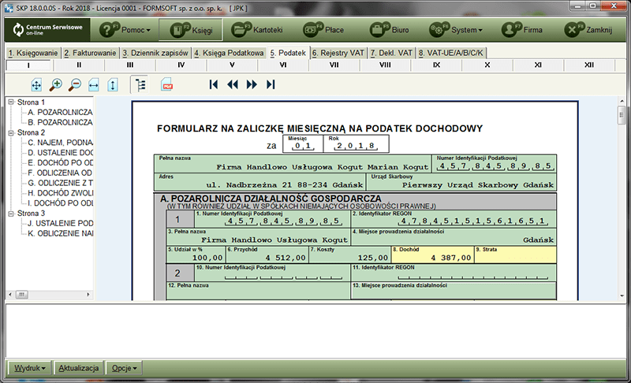
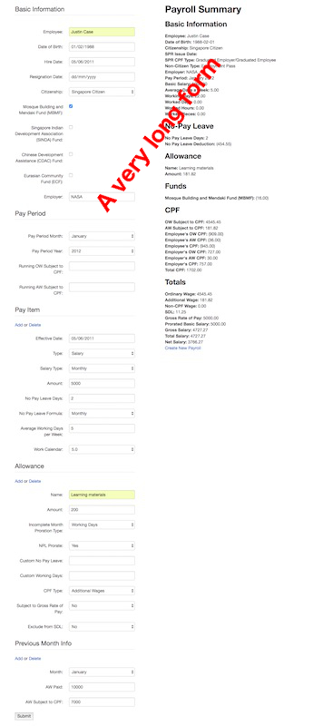
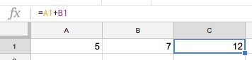
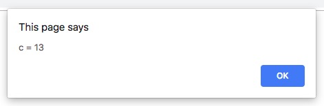

class: center, middle

# Spreadsheet-like programming in JS with _xcell_

## Tomek Maszkowski, @tomazy


???

Hi everyone!

My name is Tomek and I'm a freelance, full-stack developer.

I'm going to talk about spreadsheet-like programming in JavaScript with _xcell_.

---
class: center, middle

# A bit of history

???

Long time ago (in the 20th century) I was hired to port a MS DOS accounting software to Windows 98.

One of the assignments was to create interactive, WYSIWYG forms for tax return purposes.

---
class: center, middle

# Active tax forms

.responsive[]
https://www.ksiega-podatkowa.pl

???

The fields in the form depended on each other.

Some of them (yellow) were expected to be filled by the user.
The rest would recalculate accordingly.

~~The application was written in Delphi (Object Pascal).~~

---
class: center, middle

# Payroll



???

Then not so long time ago (2013), as a member of a small team, I was hired by an HR company in Singapore to build a payroll system.

To see if we're capable of understanding the requirements, they asked us first to create a payroll calculator that they could test their corner cases with.

We created a basic webpage for that.

On the left is the ever growing form to collect the input parameters.

Somewhere down there was a submit button that allowed to send the form to the backend.

The backend would do the heavy work of calculating the payroll summary and finally it would send it back (on the right).

~~We used Ruby on the backend and a bit of JavaScript on the frontend.~~

---
class: center, middle

# It was hard

???

Writing both programs was difficult.

At the heart of these programs there would be one function/method that would accept all the parameters, process them, and return another universe.

It was hard to keep the whole logic of the calculations in head.

It was hard to review the code.

It was hard to maintain it.

Those central methods just kept growing, and even though we were trying to keep things **DRY** and follow the **SRP** (Single Responsibility Principe), we would usually end up with code resembling phone cables in Bangkok.

---
class: center, middle


_my code_

---
class: center, middle

# Something was amiss

???

~~Both types of programs (the tax forms and the payroll calculator) were kind of similar.~~

~~They would take some user input and send it through some often complicated pipeline of transformations to come up with the final result.~~

~~(Actually most of the interactive programs work in such way.)~~

~~The problem was in designing and implementing these pipelines. This is were we usually got lost.~~

For some reason it felt more natural to design this calculations in a spreadsheet than in a programming language like Pascal, Ruby or JavaScript.

In fact, the HR employees would bring their test cases to us in spreadsheets!

Sometimes we would use those spreadsheets as a blueprint for the calculations we were trying to implement in our program.

But when you try to do this, you quickly realise that something gets lost in the translation.

I think it is so because a "spreadsheet program" is not organized around time (sequence of instructions), but as a **spatial relationship**.

---
class: center, middle

# Spreadsheets



???

This is how you create "programs" in spreadsheets:

_The value of this cell (`C1`) is a sum of this cell here (`A1`) and this one over here (`B1`)_ .

And the spreadsheet will "magically" satisfy this formula for you.
You will not have to worry _when_ to update the cell or if it ever becomes out of date.
Whenever any of the dependent cells change, it will **always** be up to date.

---
class: middle

```javascript
var a = 5
var b = 7

var c = a + b // 13
```

???

Our favorite, sequential languages don't work in this way.

If in our program we define two variables `a` and `b`, and then another one (`c`) that depends on the first two...

--

```javascript
//...

a = 35

alert('c = ' + c)
```

???

...and later we change `a`,

the variable `c` will still hold the previous value: `13`.

--

.center[]

???

If we want `c` to equal `42` we would have to change it explicitly ourselves.

This is how **imperative programming** works.

A spreadsheet, on the other hand, is an example of a cell-based **dataflow** programming.

---
class: center, middle

# Dataflow programming

> In computer programming, **dataflow programming** is a programming paradigm that models a program as a _directed graph of the data flowing between operations_ (...).

_--Wikipedia_

???

Here's how Wikipedia describes [dataflow programming][dataflow_programming]:

The idea of a _"directed graph of the data flowing between operations"_ seemed to me as something that should not be very hard to implement in any language.

I was kind of expecting that such libraries would already exist.

I looked at the functional reactive solutions in JavaScript and what I found was not quite what I wanted.

I was looking for a simple library that, like a spreadsheet, would allow me to describe my data as a graph of dependencies with formulas.

I haven't found anything satisfying so I decided to see how hard it would be to create such a library.

I named it `xcell`.

---
class: center, middle

# xcell

https://github.com/tomazy/xcell

???

Using WDD (Wish Driven Development) I came up with a simple API that I'd like to use in order to describe the graph data and the operations:

---
class: middle

.center[
  # xcell
]

```javascript
const A = xcell(5)
const B = xcell(7)
const C = xcell([A, B], add)

assert.equal(C.value, 5 + 7)

A.value = 35
assert.equal(C.value, 35 + 7)

function add(x, y) {
  return x + y
}
```

???

Here `A`, `B` and `C` would be "cells" that wrap their values.

`A` and `B` don't depend on any other cell so they are just inputs.
Like spreadsheet cells that don't contain formulas but a value (number, text, date, etc.)

`C` on the other hand **explicitly** depends on `A` and `B` (the first argument) and defines the operation that should be performed to calculate the current value of the cell.
In this case it's `add` (the second argument) - a function that adds two numbers up.

Whenever `A` and/or `B` change - `C` synchronously updates its value.

---
class: center, middle

# Demo

???

1. Show the pizza example page with the **inspector hidden**!
2. Describe what it does.
3. Show VSCode with the code of the example
4. Walk through the code (events)
5. Go back to the web page and **show the inspector**!

---
class: center, middle

# Before I thank you

???

~~I'm not sure why dataflow programming is not more popular.~~

~~RxJS and others get us closer to it but a price of learning all those operators can be a bit too high.~~

`xcell` doesn't introduce a bunch of new concepts.

No action creators, no decorators, no `switchMap`, etc.

Just standard functions to describe what to do with your data, arrays for dependencies and events for change notification.

It can be used with any JS framework or with no framework at all. Client and server-side.

It's still in its **infancy** and probably not production ready.

But if you have some time - please give it a try and let me know what you think.

---
class: center, middle

# Thank you

https://github.com/tomazy/xcell

@tomazy

[skp]: https://www.ksiega-podatkowa.pl/skp-firma/wyglad-programu
[dataflow_programming]: https://en.wikipedia.org/wiki/Dataflow_programming
[xcell]: https://github.com/tomazy/xcell
